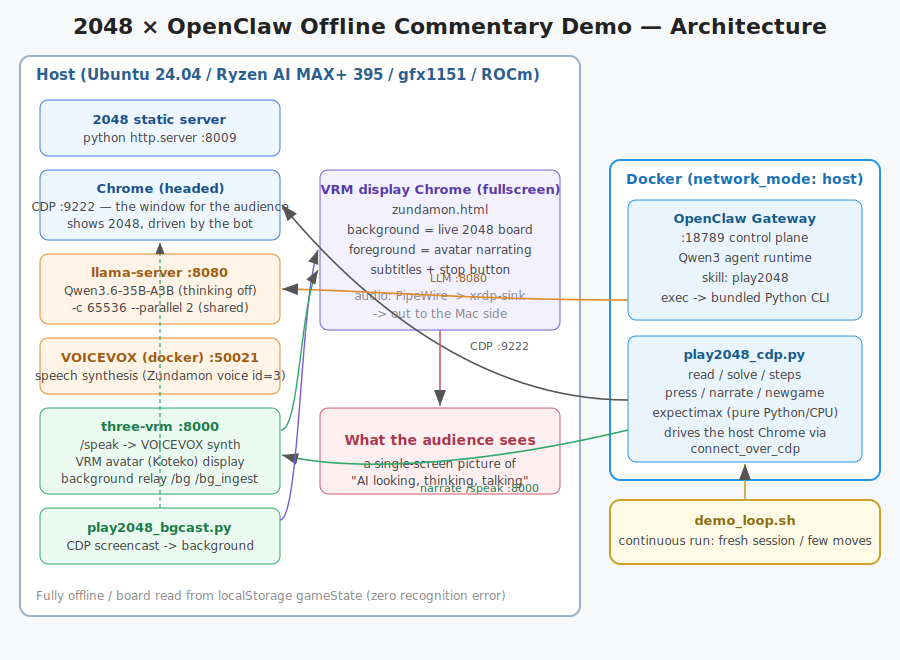
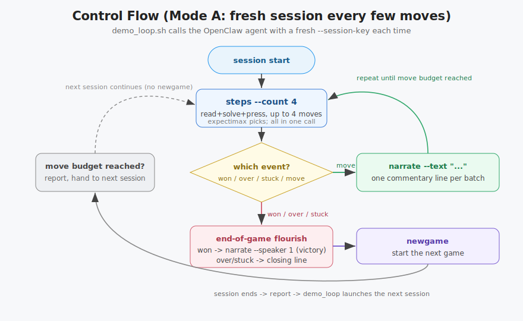
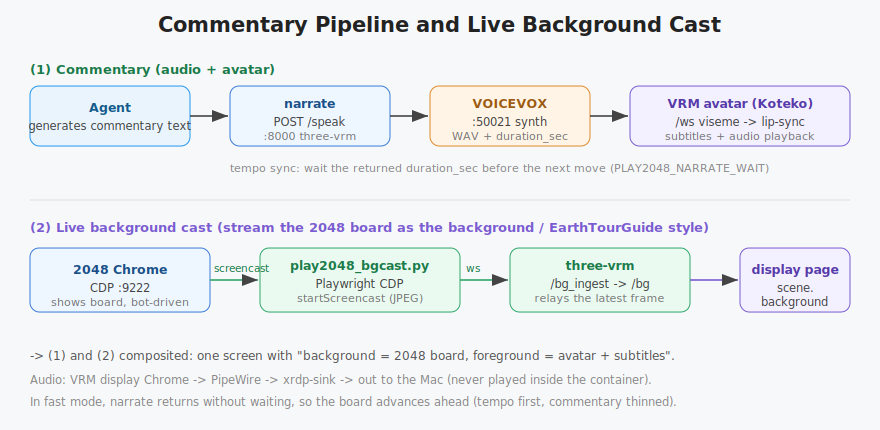

# TECHNICAL.md — Technical Details

Internal design and implementation notes for the 2048 × OpenClaw offline commentary demo.
Setup/run instructions: [`README.md`](README.md). OpenClaw investigation: [`openclaw_phase1_findings.md`](openclaw_phase1_findings.md).
日本語版: [`TECHNICALJ.md`](TECHNICALJ.md).

---

## 1. Overall structure



| Layer | Responsibility | Location |
|---|---|---|
| Orchestration | OpenClaw Gateway + agent (Qwen3) | Docker (network_mode: host) |
| Move decision | expectimax (pure Python) | inside container, CPU |
| Browser control | Playwright `connect_over_cdp` | container → host Chrome |
| Board display | gabrielecirulli/2048 + Chrome (headed) | host |
| Commentary text shaping | llama-server / Qwen3.6-35B-A3B | host gfx1151 (shared) |
| Speech synthesis | VOICEVOX | host (docker) |
| Avatar/subtitles/background | three-vrm + zundamon.html (three.js + three-vrm) | host Chrome |

**Design core**: to make OpenClaw look "more agentic," it sits at the center of the per-turn control
loop (Mode A). However, **move quality and speed are fixed to expectimax** — the LLM never picks
moves (it is weak and slow at it). The LLM only generates commentary text and drives the loop.

### 1.1 Confirmed design decisions (settled)

1. **OpenClaw is the orchestration core** of the demo, running on Docker (Compose).
2. The game is **gabrielecirulli/2048** (the original), served locally with `python -m http.server` (offline).
3. **The board is read from localStorage `gameState`** as JSON (not image recognition, not DOM parsing).
   Loss is detected from the `.game-message` class; a win (2048) from `state["won"]`.
4. **Move decision is fixed to expectimax (pure Python, CPU)**. The LLM does not choose moves.
5. moondream2 (if used) is for scene description only, never for move decisions.
6. llama-server is **shared** with AIzunda / EarthTourGuide. It runs with `--parallel 2` or more so that
   conversation and commentary calls are not serialized.
7. Heavy inference (LLM/VLM) on gfx1151 (ROCm); OpenClaw, expectimax, and browser control on CPU.
8. The base stack is **`~/EarthTourGuide`**. 2048 is on `:8009` (`:8000` is used by three-vrm).
   three-vrm is **vendored (copied)** into `three-vrm/` in this repo; the shared source stays unmodified.
9. The "picture" approach is **VRM avatar co-located + background compositing**: the 2048 screen is
   streamed into the VRM's `scene.background`, and the avatar narrates in front of it as a single-screen picture.

### 1.2 Acceptance criteria

- Boots and completes fully offline.
- OpenClaw (Docker) is at the center of the control loop (orchestration + commentary go through OpenClaw).
- The board is read from localStorage with zero recognition error; expectimax reaches 2048 stably.
- The avatar narrates in sync with each move (batch).
- On the shared llama-server, AIzunda conversation and this demo's commentary calls are not serialized (`--parallel 2`+).

---

## 2. Reading the board (zero recognition error)

The 2048 `GameManager` saves the full state to `localStorage["gameState"]` as JSON every turn.
Reading that over CDP means no image recognition and no DOM parsing — zero error.

```js
window.localStorage.getItem('gameState')
// → {"grid":{"cells":[[col0...],[col1...]]}, "score":N, "won":bool, ...}
```

- `cells[x][y]` is **x=column, y=row**. `parse_board()` transposes it into `board[y][x]` (a 4×4 matrix).
- **On game over, `gameState` is deleted** by design → loss is detected from the `.game-message` class
  (whether it contains `game-over`). A win (2048) is detected from `state["won"]`.
- Under high latency across the container, `gameState` can momentarily go missing (`None`) →
  `settle_status()` re-reads until the board is settled or it is over, absorbing the transient.

Implementation: `play2048_cdp.py:parse_board / game_status / settle_status`, `play2048_bot.py:read_board`.

---

## 3. The expectimax solver (`play2048_bot.py`)

The move-decision logic is pure functions, reused as-is (`play2048_cdp.py` imports `choose_move`).

- **`move_board(board, dir)`**: 0=up / 1=right / 2=down / 3=left. `_compress_merge_left()` compresses and merges one line.
- **Evaluation `evaluate()`**:
  - **Snake weights**: gather the largest tile in the top-left to preserve monotonicity (classic heuristic; `WEIGHT`, weighted by `4**k`).
  - **Empty-cell bonus** `EMPTY_BONUS = 4**13` (prevents getting boxed in).
- **`expectimax(board, depth, is_chance)`**: player nodes are max; chance nodes take the expectation over
  placing 2 (0.9) / 4 (0.1) on empty cells. Updates in-place to avoid deepcopy.
- **Variable search depth `_depth_for()`**: fewer empties means fewer branches, so it reads deeper (empties ≥6→3, ≥3→4, otherwise 5).

A standalone mode (headed launch via Playwright, commentary as a console stub) remains in `main()`.

---

## 4. OpenClaw integration

### 4.1 Skill shape (an important design implication)

OpenClaw skills do **not** register custom typed tools in JS. A skill = `SKILL.md` (YAML front matter +
markdown instructions). The body tells the agent "when and which built-in tool to call." **A bundled
script is executed via the built-in `exec` tool.**

- Placement: `state/workspace/skills/play2048/` (`SKILL.md` + `play2048_cdp.py` + `play2048_bot.py`)
- Front matter: `name` (lowercase alnum + hyphen), `description` (one line), `metadata.openclaw.requires.bins: [python3]`, `os: [linux]`
- The agent runs `python3 {baseDir}/play2048_cdp.py <subcommand>` via `exec` and reads the one-line JSON on stdout.

### 4.2 CLI subcommands (`play2048_cdp.py`)

Each command does `connect_over_cdp` every time and keeps state in the browser's localStorage (**stateless**).
stdout is machine-readable one-line JSON; human logs go to stderr.

| Subcommand | Role | Main output |
|---|---|---|
| `read` | return board and state | `board/score/won/over/max_tile/empty` |
| `solve` | next move via expectimax | `direction/key/dir_ja` |
| `press <dir>` | send an arrow key | `pressed` |
| `step` | bundle read+solve+press into one call | `event: move/won/over/stuck/wait` |
| **`steps --count N`** | **make several moves in one call** (the star of the fast/thinned mode) | `event, moves, score, max_tile, board` |
| `narrate` | commentary (sends to three-vrm `/speak`) | `event:narrate, spoken, duration_sec, waited_sec` |
| `newgame` | start a new game | `event:newgame` |
| `play` | monolithic auto-play (fallback) | `result: won/lost/stuck` |

`steps` is the star of the demo: within one session it makes up to N moves and, if it hits won/over/stuck/wait
midway, stops and returns what it has. This avoids an LLM round-trip per move and **advances several moves at
once while thinning commentary** (measured: 8 moves ≈ 1.5s; the old per-step approach took ~70s for 4 moves).

### 4.3 Control flow (Mode A, continuous run)



`demo_loop.sh` is the outer loop, calling the OpenClaw agent with a fresh `--session-key` each time.
The `SKILL.md` procedure:

1. **No newgame at session start** (continue the previous session's game; the state remains in the browser).
2. Until the move budget (default 8), repeat `steps --count 4` → `narrate` (once per batch).
3. event `won` → `narrate --speaker 1` (victory in the "amaama" voice) → `newgame`.
4. `over`/`stuck` → closing commentary → `newgame`.
5. Report moves/score/max in one line and end → the next session continues.

A fresh session every few moves **avoids both context overflow and an endless game** while keeping
OpenClaw at the center of control (acceptance criteria).

---

## 5. Confirmed networking and context configuration

Real-machine verification updated several initial hypotheses. Key points (details in `openclaw_phase1_findings.md`):

### 5.1 `network_mode: host` (not bridge)

- **Chrome 149 binds remote-debugging only to 127.0.0.1** (it ignores `--remote-debugging-address=0.0.0.0`).
  → bridge + `host.docker.internal` does not reach CDP.
- With **host networking**, localhost reaches all of CDP(9222)/2048(8009)/llama(8080)/VOICEVOX(50021)/three-vrm(8000).
  Chrome's DNS-rebinding (Host header) restriction is also avoided via localhost.
- Hence the provider baseUrl is `http://localhost:8080/v1` (with host net, `host.docker.internal` cannot be resolved).
- Chrome is started with `--remote-allow-origins=*` (to allow the WebSocket connection).
- The host name is resolved to an IP before CDP connection (`_cdp_endpoint`) — a DNS-rebinding workaround to make the Host an IP/localhost.

### 5.2 No sandbox

`exec` runs directly inside the gateway container (Python+playwright are bundled).
The `sandbox.docker.network: bridge` / browser allowlist considered initially turned out to be **unnecessary**.

### 5.3 Context-size rule (most important)

- OpenClaw requires **"prompt tokens ≤ `contextWindow` ÷ 2"** (it reserves the other half for the response).
- The maximum usage the guard allows = `contextWindow/2 + maxTokens` = 24576 + 1024 = **25600 tokens**.
  This just needs to fit in llama's **per-slot n_ctx** (no need to match `contextWindow` to n_ctx).
- Prompt-shrinking measures:
  - `skills.allowBundled: []` removes ~57 bundled skills from the system prompt.
  - `plugins.deny: [browser, canvas, device-pair, file-transfer, memory-core, phone-control, talk-voice]`
    disables 7 tool-supplying plugins (gateway log becomes `0 plugins`).
  - Effect: the first prompt **P = 16,902 tokens** (down ~20% from ~21k).
- **Confirmed config**: llama `-c 65536 --parallel 2` (per-slot 32768) / openclaw.json `contextWindow: 49152`, `maxTokens: 1024`.
  In verification, a 2-move step→narrate peaked at n_past=19,610 (truncated=0), VRAM 24.8GB/48GB.
  → **No overflow while keeping `--parallel 2`** (AIzunda conversation and commentary calls are not serialized).
- KV-cache prefix reuse kicks in, so from the 2nd move on the prompt eval is only ~150-730 tokens (not a full re-eval per turn).

### 5.4 LLM provider config (`openclaw.json`)

```json5
models.providers."llama-host": {
  baseUrl: "http://localhost:8080/v1",
  apiKey: "dummy-key",            // llama-server does not authenticate
  api: "openai-completions",      // same as vLLM/SGLang
  models: [{ id: "qwen3", reasoning: false,
             contextWindow: 49152, maxTokens: 1024,
             compat: { thinkingFormat: "qwen-chat-template" } }]   // thinking disabled
}
agents.defaults.model.primary: "llama-host/qwen3"
gateway.mode: "local"             // without this, the gateway is blocked from starting
```

---

## 6. Commentary pipeline (Phase 2)



### 6.1 narrate → three-vrm → VOICEVOX → VRM

- `narrate` sends commentary text to three-vrm's **`POST /speak` (:8000)** (no added deps — urllib only).
  three-vrm synthesizes with VOICEVOX and streams viseme data over `/ws` to the VRM display page
  (zundamon.html) → lip-sync + subtitles + playback.
- env: `PLAY2048_VRM_URL` (default `http://localhost:8000`) / `PLAY2048_SPEAKER_ID` (default 3=Zundamon normal, 1=amaama for wins).
- Audio plays via **VRM display Chrome → PipeWire → xrdp-sink → the Mac side** (never inside the container).
- If `/speak` fails, it continues with text only (the loop does not stop — a fallback).

### 6.2 Tempo sync

- The `/speak` response adds **`duration_sec` (playback length of the synthesized WAV)** (parsed by `_wav_duration_sec()`; backward compatible).
- `narrate` returns after waiting `duration_sec` → the step→narrate loop becomes "next move only after speaking ends," so commentary does not overlap.
- env: `PLAY2048_NARRATE_WAIT` (0 disables) / `PLAY2048_NARRATE_WAIT_FACTOR` (default 1.0) / `PLAY2048_NARRATE_MAX_WAIT` (default 8s) / `--no-wait`.
- **Fast/thinned mode (the actual demo)**: in compose, `PLAY2048_NARRATE_WAIT=0` + `PLAY2048_MOVE_DELAY=0.2`.
  narrate returns without waiting, and commentary is thinned to one line per several moves for tempo.

### 6.3 The character (Koteko)

- The commentary character was changed from Zundamon (ending "-no-da") to **Koteko (the "-aru" speech style: -aru / -aruyo / -arune)**.
  The voice stays VOICEVOX Zundamon (id=3); the VRM is `koteko.vrm`.

---

## 7. Live background cast (`play2048_bgcast.py`)

The 2048 screen is streamed into the VRM's `scene.background`, making a **single-screen picture** with
the avatar narrating in front (same approach as EarthTourGuide's earth-controller).

```
2048 Chrome(:9222) ──Playwright CDP screencast──► bgcast ──ws /bg_ingest──► three-vrm ──/bg──► zundamon.html scene.background
```

- **The key is to go through Playwright rather than handling raw CDP over a homemade WS** (same as earth-controller). aiohttp is only used for the bridge send.
- `Page.startScreencast`(JPEG) grabs frames → `screencastFrameAck` is top priority (skip it and it stalls).
- three-vrm has `/bg_ingest` (ingest) and `/bg` (subscribe) WS endpoints, caching the latest frame to push to new subscribers immediately.
- **Zoom fit**: shrinks the 2048 page to fit the window so the board is not cut off at the bottom (`PLAY2048_BGCAST_ZOOM`, default "fit").
  Re-applied after `do_newgame`'s page.reload via CDP `addScriptToEvaluateOnNewDocument`. Measured zoom ≈ 0.81 at 1024×768.
- bgcast needs a python with playwright+aiohttp (`.venv` preferred; otherwise it reuses the EarthTourGuide venv).

---

## 8. Demo operation features (Phase 3)

- **Stop button**: the "⏹ Stop demo" button on the avatar screen → three-vrm `POST /stop_demo`.
  It pinpoints the target via `/tmp/demo_loop.pid` and sends SIGINT, and also `docker stop`s the in-flight
  agent session (the `name=openclaw-cli-run` container) for an **immediate stop** (avoiding pkill -f mismatches).
- **Subtitles**: clamped to 3 lines (`-webkit-line-clamp:3`).
  **Accumulation-bug fix**: `/speak` sends `turn_start` before each utterance to reset `botReplyBuf` (without it, subtitles accumulate and look frozen).
- **Facing front**: `koteko.vrm` is VRM1.0 (`rotateVRM0` is a no-op). After loading, `gltf.scene.rotation.y += atan2(...)`
  turns it toward the camera, keeping it front-facing even when the offset/distance change.
- **Continuous run + auto-restart**: `demo_loop.sh` (Mode A). On a service outage it waits and re-checks;
  a failed session moves on (fallback). Each session has a `timeout`.

---

## 9. Artifact map

| File | Role |
|---|---|
| `play2048_bot.py` | expectimax solver (pure functions; imported by the CLI) |
| `play2048_cdp.py` | the CDP CLI (read/solve/press/step/**steps**/narrate/newgame/play) |
| `play2048_bgcast.py` | live background cast bridge (CDP screencast → three-vrm /bg_ingest) |
| `start_all.sh` / `stop_all.sh` | start/stop the whole demo (tmux `ai2048`) |
| `start_phase2_display.sh` | start the VRM fullscreen display + background cast |
| `demo_loop.sh` | continuous run + auto-restart (Mode A) |
| `phase0_cdp_test.py` / `start_phase0.sh` | Phase 0 verification (old; normally use start_all.sh) |
| `openclaw-demo/` | the OpenClaw container set (Dockerfile / compose / openclaw.json / skill) |
| `three-vrm/` | the VRM display server (vendored from EarthTourGuide; `/speak` / `/bg` / `/stop_demo`) |
| `.venv/` | the venv for bgcast (playwright + aiohttp) |

External clones (under HOME): `~/2048` (the game), `~/openclaw` (the official repo, for reference).

---

## 10. Known pitfalls

- Reusing session `main` causes `Cannot continue from message role: assistant` → pass a unique `--session-key` each time.
- Truncating the log with `: >` while llama is running breaks prompt-eval measurement → start a fresh log when measuring.
- bgcast is skipped if `.venv` lacks playwright+aiohttp (warning in `/tmp/bgcast.log`).
- Chrome must be started headed with the dedicated profile `/tmp/chrome-cdp-2048`. Remove `SingletonLock` first.
- Normal mode (with a narrate wait per move) is not suited to 1000 consecutive moves (it's a "show" tempo for the demo); fast mode addresses this by thinning.

---

## 11. Remaining work

- **Long-duration continuous run / endurance check** (5 minutes done — 0 failures, no VRAM leak; 1–2 hours pending).
- Optional: add scene description via moondream2 (currently the agent generates commentary from the board JSON).
- Cleanup: the skill-bundled `play2048_cdp.py`/`play2048_bot.py` are copies of the top-level ones; unify the source of truth.
