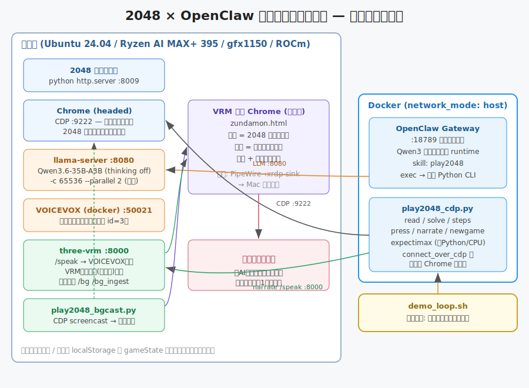
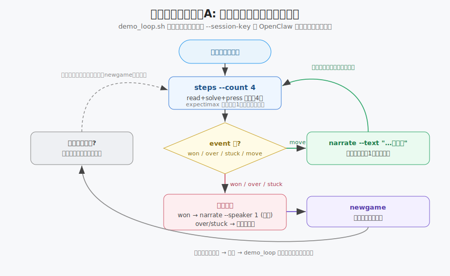
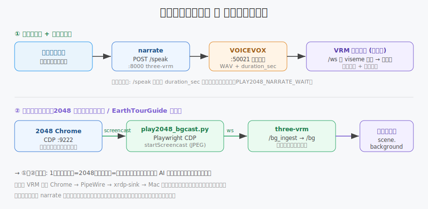

# TECHNICALJ.md — 技術詳細

> English: [`TECHNICAL.md`](TECHNICAL.md)

2048 × OpenClaw オフライン実況デモの内部設計・実装メモ。
セットアップ/実行手順は [`READMEJ.md`](READMEJ.md)、OpenClaw 調査結果は [`openclaw_phase1_findings.md`](openclaw_phase1_findings.md)。

---

## 1. 全体構成



| レイヤ | 担当 | 配置 |
|---|---|---|
| オーケストレーション | OpenClaw Gateway + エージェント(Qwen3) | Docker（network_mode: host） |
| 手の決定 | expectimax（純 Python） | コンテナ内 CPU |
| ブラウザ制御 | Playwright `connect_over_cdp` | コンテナ → ホスト Chrome |
| 盤面表示 | gabrielecirulli/2048 + Chrome(headed) | ホスト |
| 実況テキスト整形 | llama-server / Qwen3.6-35B-A3B | ホスト gfx1151（共用） |
| 音声合成 | VOICEVOX | ホスト（docker） |
| アバター/字幕/背景 | three-vrm + zundamon.html（three.js + three-vrm） | ホスト Chrome |

**設計の核**: OpenClaw を「より agentic に見せる」ため、毎ターンの制御ループの中心に置く（方式A）。
ただし **手の質と速度は expectimax に固定** し、LLM には手を選ばせない（弱い・遅いため）。
LLM は実況テキストの生成と制御ループの駆動のみを担う。

### 1.1 確定した設計判断（再検討不要）

1. **OpenClaw を本デモのオーケストレーション本体**とし、Docker（Compose）で動作させる。
2. ゲームは **gabrielecirulli/2048**（本家）を `python -m http.server` でローカル配信（オフライン）。
3. **盤面は localStorage の `gameState` から JSON で読む**（画像認識でも DOM パースでもない）。
   敗北は `.game-message` のクラス、勝利(2048)は `state["won"]` で判定。
4. **手の決定は expectimax（純 Python・CPU）固定**。LLM には手を選ばせない。
5. moondream2 は（採用する場合）情景描写専用。手の決定には使わない。
6. llama-server は AIzunda / EarthTourGuide と **共用**。`--parallel 2` 以上で起動し、
   会話と実況呼び出しが直列化しないようにする。
7. 重い推論（LLM/VLM）は gfx1151（ROCm）。OpenClaw 本体・expectimax・ブラウザ制御は CPU。
8. ベーススタックは **`~/EarthTourGuide`**。2048 は `:8009`（`:8000` は three-vrm が使用）。
   三-vrm はこのリポジトリ配下 `three-vrm/` に **vendoring（コピー）** して使い、共有元は無改変。
9. 「絵」方式は **VRM アバター同居 + 背景化**。2048 の画面を VRM の `scene.background` に流し、
   その前でアバターが実況する 1 画面の絵にする。

### 1.2 受け入れ基準

- 完全オフラインで起動〜完走できる。
- OpenClaw（Docker）が制御ループの中心にいる（オーケストレーション + 実況を OpenClaw 経由で実行）。
- 盤面取得は localStorage 由来で認識誤差ゼロ。expectimax で安定して 2048 到達。
- アバターが各手（バッチ）に同期して実況する。
- 共用 llama-server 上で AIzunda の会話と本デモの実況呼び出しが直列化しない（`--parallel 2`+）。

---

## 2. 盤面の取得（認識誤差ゼロ）

2048 の `GameManager` は毎ターン完全な状態を `localStorage["gameState"]` に JSON で保存する。
これを CDP 経由で読むため、画像認識も DOM パースも不要で誤差ゼロ。

```js
window.localStorage.getItem('gameState')
// → {"grid":{"cells":[[col0...],[col1...]]}, "score":N, "won":bool, ...}
```

- `cells[x][y]` は **x=列・y=行**。`parse_board()` で `board[y][x]` に転置して 4×4 行列にする。
- **ゲームオーバー時は `gameState` が消える**仕様 → 敗北判定は `.game-message` のクラス
  （`game-over` を含むか）で行う。勝利(2048)は `state["won"]` で判定。
- コンテナ越しの高レイテンシで `gameState` が一瞬欠落する（`None`）ことがある →
  `settle_status()` が board 確定 or over まで読み直して過渡状態を吸収する。

実装: `play2048_cdp.py:parse_board / game_status / settle_status`、`play2048_bot.py:read_board`。

---

## 3. expectimax ソルバ（`play2048_bot.py`）

手の決定ロジックは純粋関数なのでそのまま流用（`play2048_cdp.py` が `choose_move` を import）。

- **`move_board(board, dir)`**: 0=上/1=右/2=下/3=左。`_compress_merge_left()` で 1 列を詰めてマージ。
- **評価関数 `evaluate()`**:
  - **蛇行(snake)重み**: 最大タイルを左上に集めて単調性を保つ古典ヒューリスティック（`WEIGHT`、`4**k` で重み付け）。
  - **空きマスボーナス** `EMPTY_BONUS = 4**13`（詰まり防止）。
- **`expectimax(board, depth, is_chance)`**: プレイヤーノードは max、チャンスノードは
  空きマスに 2(0.9)/4(0.1) を置いた期待値。`in-place` 更新で deepcopy を回避。
- **可変探索深さ `_depth_for()`**: 空きが少ないほど分岐が減るので深く読む（空き ≥6→3、≥3→4、それ未満→5）。

スタンドアロン実行（Playwright で headed 起動、実況はコンソールスタブ）も `main()` に残してある。

---

## 4. OpenClaw 統合

### 4.1 スキルの形（重要な設計含意）

OpenClaw のスキルは「独自の typed tool を JS で登録する」ものでは **ない**。
スキル = `SKILL.md`（YAML フロントマター + markdown 本文の指示書）。本文がエージェントに
「いつ・どの組み込みツールを呼ぶか」を教える。**同梱スクリプトは組み込み `exec` ツールで実行** する。

- 配置: `state/workspace/skills/play2048/`（`SKILL.md` + `play2048_cdp.py` + `play2048_bot.py`）
- フロントマター: `name`（小文字英数+ハイフン）, `description`（1 行）, `metadata.openclaw.requires.bins: [python3]`, `os: [linux]`
- エージェントは `python3 {baseDir}/play2048_cdp.py <subcommand>` を `exec` で呼び、stdout の 1 行 JSON を読む。

### 4.2 CLI サブコマンド（`play2048_cdp.py`）

各コマンドは毎回 `connect_over_cdp` し、状態はブラウザの localStorage に持つ（**ステートレス**）。
stdout は機械可読の 1 行 JSON、人間向けログは stderr。

| サブコマンド | 役割 | 主な出力 |
|---|---|---|
| `read` | 盤面と状態を返す | `board/score/won/over/max_tile/empty` |
| `solve` | expectimax で次の手 | `direction/key/dir_ja` |
| `press <dir>` | 矢印キー送出 | `pressed` |
| `step` | read+solve+press を 1 回に束ねる | `event: move/won/over/stuck/wait` |
| **`steps --count N`** | **複数手を 1 コールで一気に着手**（最速・間引き用の主役） | `event, moves, score, max_tile, board` |
| `narrate` | 実況（three-vrm `/speak` へ送る） | `event:narrate, spoken, duration_sec, waited_sec` |
| `newgame` | 新規ゲーム開始 | `event:newgame` |
| `play` | モノリシック自動プレイ（保険） | `result: won/lost/stuck` |

`steps` がデモの主役: 1 セッション内で最大 N 手を着手し、途中で won/over/stuck/wait なら
そこまでで止めて返す。これで **エージェントの LLM 往復を手ごとに発生させず数手まとめて進め、
実況を間引く**（実測 8 手 ≈ 1.5s。旧 step 方式は 4 手で約 70s）。

### 4.3 制御フロー（方式A・連続稼働）



`demo_loop.sh` が外側ループで、毎回フレッシュな `--session-key` で OpenClaw エージェントを呼ぶ。
`SKILL.md` の手順:

1. **セッション開始時に newgame しない**（前セッションのゲームを継続。ブラウザに状態が残る）。
2. 指定手数（既定 8）まで `steps --count 4` → `narrate`（バッチごとに 1 回）を繰り返す。
3. event が `won` → `narrate --speaker 1`（あまあま声で勝利演出）→ `newgame`。
4. `over`/`stuck` → 締めの実況 → `newgame`。
5. 手数・score・max を一言で報告して終了 → 次セッションが続きを回す。

数手ごとに新セッションにすることで **コンテキスト溢れも無限ゲームも回避** しつつ、
OpenClaw を制御の中心に保つ（受け入れ基準）。

---

## 5. ネットワークとコンテキストの確定構成

実機検証で当初の仮説をいくつも更新した。要点（詳細は `openclaw_phase1_findings.md`）:

### 5.1 `network_mode: host`（bridge ではない）

- **Chrome 149 は remote-debugging を 127.0.0.1 にしか bind しない**（`--remote-debugging-address=0.0.0.0` を無視）。
  → bridge + `host.docker.internal` では CDP に届かない。
- **host ネットワーク**なら localhost で CDP(9222)/2048(8009)/llama(8080)/VOICEVOX(50021)/three-vrm(8000) 全てに到達。
  Chrome の DNS-rebinding（Host ヘッダ）制限も localhost で回避。
- このため provider baseUrl も `http://localhost:8080/v1`（host net では `host.docker.internal` は解決不可）。
- Chrome 起動には `--remote-allow-origins=*`（WebSocket 接続許可）も付与。
- CDP 接続前にホスト名を IP 解決する（`_cdp_endpoint`）— DNS-rebinding 対策で Host を IP/localhost にするため。

### 5.2 サンドボックス不使用

`exec` は gateway コンテナ内で直接実行（コンテナに Python+playwright 同梱）。
当初検討した `sandbox.docker.network: bridge` / browser allowlist は **不要だった**。

### 5.3 コンテキスト・サイズの規則（最重要）

- OpenClaw は **「プロンプトトークン ≤ `contextWindow` ÷ 2」** を要求（残り半分を応答用に予約）。
- ガードが許す最大使用量 = `contextWindow/2 + maxTokens` = 24576 + 1024 = **25600 トークン**。
  これが llama の **per-slot n_ctx に収まれば良い**（`contextWindow` を n_ctx に揃える必要はない）。
- プロンプト縮小策:
  - `skills.allowBundled: []` で bundled スキル約 57 個をシステムプロンプトから除外。
  - `plugins.deny: [browser, canvas, device-pair, file-transfer, memory-core, phone-control, talk-voice]`
    でツール供給プラグイン 7 個を無効化（gateway ログが `0 plugins` に）。
  - 効果: 初回プロンプト **P = 16,902 トークン**（旧 ~21k から約 20% 減）。
- **確定構成**: llama `-c 65536 --parallel 2`（per-slot 32768）／ openclaw.json `contextWindow: 49152`, `maxTokens: 1024`。
  検証で 2 手 step→narrate がピーク n_past=19,610（truncated=0）、VRAM 24.8GB/48GB。
  → **`--parallel 2` を保ったまま overflow なし**（AIzunda の会話と実況呼び出しが直列化しない）。
- KV キャッシュのプレフィックス再利用が効き、2 手目以降の prompt eval は ~150-730 トークンのみ（毎ターン全再評価ではない）。

### 5.4 LLM プロバイダ設定（`openclaw.json`）

```json5
models.providers."llama-host": {
  baseUrl: "http://localhost:8080/v1",
  apiKey: "dummy-key",            // llama-server は認証しない
  api: "openai-completions",      // vLLM/SGLang と同じ
  models: [{ id: "qwen3", reasoning: false,
             contextWindow: 49152, maxTokens: 1024,
             compat: { thinkingFormat: "qwen-chat-template" } }]   // thinking 無効
}
agents.defaults.model.primary: "llama-host/qwen3"
gateway.mode: "local"             // 無いと起動ブロック
```

---

## 6. 実況パイプライン（Phase 2）



### 6.1 narrate → three-vrm → VOICEVOX → VRM

- `narrate` は実況テキストを three-vrm の **`POST /speak`（:8000）** へ送る（依存追加なし・urllib のみ）。
  three-vrm が VOICEVOX で合成し、`/ws` 経由で VRM 表示ページ（zundamon.html）へ viseme 付きで配信 → 口パク + 字幕 + 再生。
- env: `PLAY2048_VRM_URL`（既定 `http://localhost:8000`）/ `PLAY2048_SPEAKER_ID`（既定 3=ずんだもんノーマル、勝利時 1=あまあま）。
- 音声は **VRM 表示 Chrome → PipeWire → xrdp-sink → Mac 側** で再生（コンテナ内では再生しない）。
- `/speak` 失敗時はテキストのみで継続（ループは止めない＝フォールバック）。

### 6.2 テンポ同期

- `/speak` のレスポンスに **`duration_sec`（合成 WAV の再生秒数）** を追加（`_wav_duration_sec()` で WAV をパース。後方互換）。
- `narrate` は `duration_sec` ぶん待ってから返る → step→narrate ループが「喋り終わってから次手」になり実況が被らない。
- env: `PLAY2048_NARRATE_WAIT`(0 で無効) / `PLAY2048_NARRATE_WAIT_FACTOR`(既定 1.0) / `PLAY2048_NARRATE_MAX_WAIT`(既定 8s) / `--no-wait`。
- **最速・間引きモード（デモ本番）**: compose で `PLAY2048_NARRATE_WAIT=0` + `PLAY2048_MOVE_DELAY=0.2`。
  narrate は発話を待たず即返り、実況は数手まとめて 1 回だけにしてテンポ優先。

### 6.3 キャラクター（コテコ）

- 実況キャラはずんだもん（〜のだ）から **コテコ（元気のいい女の子: 〜だよ/〜だね/〜だよっ）** に変更。
  声は VOICEVOX ずんだもん声(id=3) のまま、VRM は `koteko.vrm`。

---

## 7. 背景ライブ配信（`play2048_bgcast.py`）

2048 の画面を VRM の `scene.background` に流し、その前でアバターが実況する **1 画面の絵**を作る
（EarthTourGuide の earth-controller と同方式）。

```
2048 Chrome(:9222) ──Playwright CDP screencast──► bgcast ──ws /bg_ingest──► three-vrm ──/bg──► zundamon.html scene.background
```

- **生 CDP を自前 WS で扱わず Playwright 経由にするのが肝**（earth-controller と同じ）。aiohttp はブリッジ送信のみ。
- `Page.startScreencast`(JPEG) でフレーム取得 → `screencastFrameAck` を最優先（怠ると止まる）。
- three-vrm は `/bg_ingest`（投入）と `/bg`（購読）の WS を持ち、最新フレームをキャッシュして新規購読者へ即送る。
- **ズーム fit**: 2048 ページを縮小してウィンドウに収め盤面の下切れを防ぐ（`PLAY2048_BGCAST_ZOOM`、既定 "fit"）。
  `do_newgame` の page.reload 後も効くよう CDP `addScriptToEvaluateOnNewDocument` で再適用。実測 1024×768 で zoom≈0.81。
- bgcast 実行には playwright+aiohttp のある python が必要（`.venv` 優先、無ければ EarthTourGuide の venv を流用）。

---

## 8. デモ運用機能（Phase 3）

- **停止ボタン**: アバター画面の「⏹ デモ停止」→ three-vrm `POST /stop_demo`。
  `/tmp/demo_loop.pid` で対象を厳密特定し SIGINT。さらに進行中のエージェントセッション
  （`name=openclaw-cli-run` コンテナ）も `docker stop` し **即時停止**（pkill -f の誤マッチ回避）。
- **字幕**: 3 行で頭打ち（`-webkit-line-clamp:3`）。
  **累積バグ修正**: `/speak` は各発話前に `turn_start` を送り `botReplyBuf` をリセット（送らないと字幕が累積し更新が止まって見える）。
- **アバター正面化**: `koteko.vrm` は VRM1.0（`rotateVRM0` は no-op）。VRM 読込後に
  `gltf.scene.rotation.y += atan2(...)` でカメラ方向へ向け、オフセット/距離が変わっても正面を保つ。
- **連続稼働 + 自動リスタート**: `demo_loop.sh`（方式A）。サービス断は wait 再確認、
  セッション失敗は次へ（フォールバック）。各セッションは `timeout` 付き。

---

## 9. 成果物マップ

| ファイル | 役割 |
|---|---|
| `play2048_bot.py` | expectimax ソルバ（純粋関数。CLI から import） |
| `play2048_cdp.py` | CDP 版 CLI（read/solve/press/step/**steps**/narrate/newgame/play） |
| `play2048_bgcast.py` | 背景ライブ配信ブリッジ（CDP screencast → three-vrm /bg_ingest） |
| `start_all.sh` / `stop_all.sh` | デモ一式の一括起動/停止（tmux `ai2048`） |
| `start_phase2_display.sh` | VRM 全画面表示 + 背景配信の起動 |
| `demo_loop.sh` | 連続稼働 + 自動リスタート（方式A） |
| `phase0_cdp_test.py` / `start_phase0.sh` | Phase0 検証（旧。通常は start_all.sh を使う） |
| `openclaw-demo/` | OpenClaw コンテナ一式（Dockerfile / compose / openclaw.json / skill） |
| `three-vrm/` | VRM 表示サーバ（EarthTourGuide から vendoring。`/speak` / `/bg` / `/stop_demo`） |
| `.venv/` | bgcast 実行用 venv（playwright + aiohttp） |

外部 clone（HOME 配下）: `~/2048`（ゲーム本体）, `~/openclaw`（公式リポジトリ・構成参照用）。

---

## 10. 既知のハマりどころ

- セッション `main` を使い回すと `Cannot continue from message role: assistant` → 毎回ユニークな `--session-key`。
- llama 起動中にログを `: >` で truncate すると prompt eval 計測が壊れる → 計測時は別ログで新規起動。
- bgcast は `.venv` に playwright+aiohttp が無いとスキップされる（`/tmp/bgcast.log` に警告）。
- Chrome は専用プロファイル `/tmp/chrome-cdp-2048` で headed 起動が必要。起動前に `SingletonLock` を削除。
- 1 手あたり narrate 待ちが入る通常モードは連続 1000 手には不向き（デモ向けの「見せる」テンポ）。最速モードは間引きで対応。

---

## 11. 残タスク

- **長時間連続稼働の耐久確認**（5 分は実施済み・失敗 0・VRAM リークなし。1〜2 時間相当が未）。
- 任意: moondream2 による情景描写の追加（現状はエージェントが盤面 JSON から実況文を生成）。
- 整理: skill 同梱の `play2048_cdp.py`/`play2048_bot.py` はトップレベルのコピー。正本を一本化したい。
